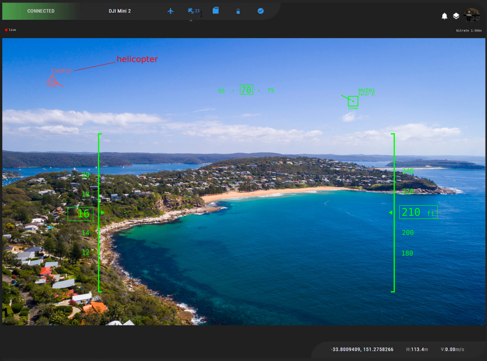

# spring-backend-eval

This exercise will help us evaluate your knowledge of Spring framework and your ability to tackle a problem independently.

## Exercice

[Flighradar24](https://www.flightradar24.com) is an internet-based service that shows real-time aircraft flight tracking information on a map. It includes flight tracking information, origins and destinations, flight numbers, aircraft types, positions, altitudes, headings and speeds. They also provide a live data REST endpoint.

As an operator of Cloud Ground Control, I would like to have access to live flying aircraft in my area.

Your task is to create a websocket service a client could reach providing a `position` (latitude and longitude) and a `radius` (in meters) to get access to a 1Hz stream of flying planes details and position in the area defined by the position and radius. The websocket connection should only stream new information.

You can access Flightradar24 live data using the following endpoint: [https://data-live.flightradar24.com/zones/fcgi/feed.js](https://data-live.flightradar24.com/zones/fcgi/feed.js). The endpoint provides a `bounds` query parameter, describing a bounding box which accept `min_lat, max_lat, min_long, max_long`. This query will automatically filter aircrafts inside the bounding box. This is an example for Sydney: [https://data-cloud.flightradar24.com/zones/fcgi/feed.js?bounds=-33.772,-34.051,150.888,151.546](https://data-cloud.flightradar24.com/zones/fcgi/feed.js?bounds=-33.772,-34.051,150.888,151.546)

See FlightRadar24 API documentation for further details about response payload. (provided separately).

## Deliverable

To be successful in this exercise, your submission should:
- be a github repository,
- be a SpringBoot application using Java,
- output flying planes in my area as `JSON` from a websocket stream
- describe how to run your application as a docker container

We will be testing your application using [Postman WebSocket Requests feature](https://learning.postman.com/docs/sending-requests/supported-api-frameworks/websocket/)

## Notes
- Thes `radius` should be used to calculate the bounding box,
- For the sake of this excercice, we will assume that aircraft inside the bounding box are inside the `radius`.
